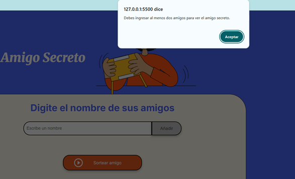
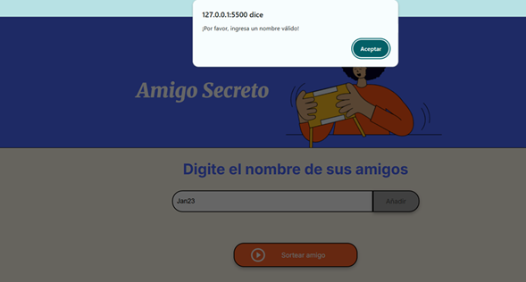
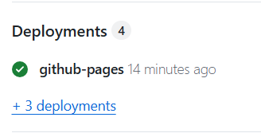
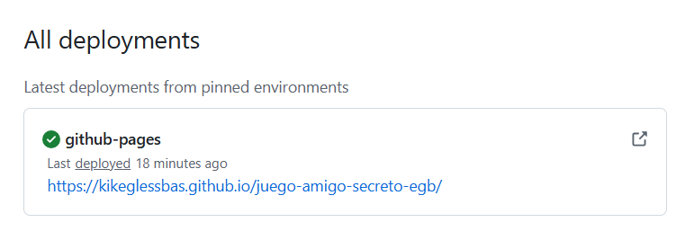
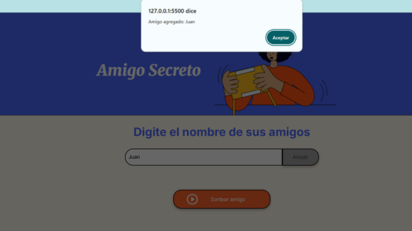
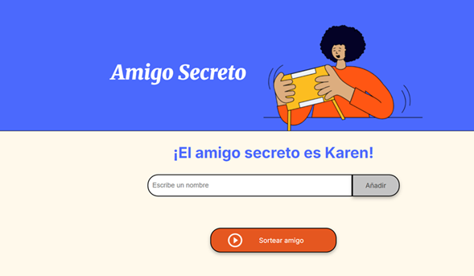

 # 🎉 Juego del Amigo Secreto

En este juego se ingresan los nombres de varios amigos para posteriormente sortearlos y así obtener el nombre del **amigo secreto**.

---

## ✨ Características

- Se accede directo desde el navegador  
- Intuitivo y fácil de usar  
- No se puede realizar el sorteo si no se han ingresado por lo menos dos nombres

- Para que se considere un nombre válido, el nombre debe contener solo texto (no se permiten números ni caracteres especiales)

- Sortea de forma aleatoria uno de los nombres ingresados, el cuál será el amigo secreto  

---

## 🚀 Acceso y descripción del juego

1. Estando en el repositorio del **Juego del Amigo Secreto**, da clic en la opción **Deployments**.

 

2. Copia la liga del repositorio.

 

3. Pega la liga directamente en el navegador para acceder al juego.  
4. Escribe el nombre de un amigo en el campo de texto y da clic en **Añadir**.

5. Una vez agregados los nombres deseados, da clic en **Sortear**, y el juego mostrará el nombre del amigo secreto de forma aleatoria.

---

## ⚙️ Especificaciones

- Código en **JavaScript**, **HTML** y **CSS**  
- Se accede directo desde el navegador, no requiere instalación  
- Sorteo aleatorio de nombres  

---

## 📥 Descarga del proyecto

1. Accede al repositorio del **Juego del Amigo Secreto**.  
2. Da clic en el botón **Code**.  
3. Selecciona la opción **Download ZIP**.

 
 
4. Elige dónde guardar el archivo en tu computadora.  

---

## 🛠️ Para modificar

- `index.html` → Modificar la página.  
- `styles.css` → Modificar el estilo de la página (fuentes, colores, etc.).  
- `script.js` → Modificar la lógica de programación y el algoritmo del sorteo de nombres.  
